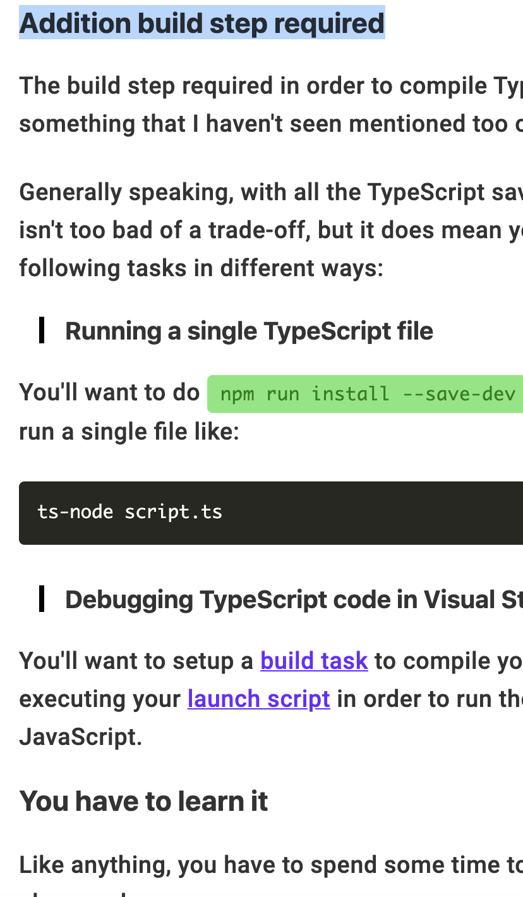

# frontend-interview

Legend:
- ✅: complete
- 🏃🏻‍♂️: still need more work
- 🚧: have not started yet

## Javascript

<details>
  <summary>✅ Explain the difference between <code>new String(1)</code> and <code>String(1)</code>.</summary> 
  
  - `new String(1)` creates a string object. `typeof new String(1) === 'object'`
  
  - `String(1)` creates a primitive string variable. `typeof String(1) === 'string'`. But we can still call String object method on this variable because the browser will auto-box this object. 

  - `new` keyword is used to execute a function and return an object. This happens when `new` is used:
    - A new object is created
    - `this` is bound to the new object
    - The new (empty) object is returned, unless the function returns its own object
    - The newly created object is assigned as value to the variable
  
  Remember you can always call `new` on classes as well as functions:
  ```js
  function Person(name){
    return {
      name
    }
  }

  const person = new Person('Joel') // { name: 'Joel' }
  
  // or this way:
  function Person(name){
    this.name = name
  }

  // or ES6 class:
  class Person{
    constructor(name){
      this.name = name
    }
  }

  const person = new Person('Joel') // { name: 'Joel' }
  ```
  
  See more at:
  - https://medium.com/front-end-weekly/difference-between-string-primitives-and-string-object-d962b7ab8496
  - https://hackernoon.com/understanding-javascript-new-keyword-ec67c8caaa74

</details>

<details>
  <summary>✅ Explain the difference between <code>const person = Person()</code> vs <code>const person = new Person()</code> provided <code>function Person(){...}</code></summary>
  
  ```js
  const person = Person()
  ```
  
  On the other hand, this just calls the function and assigns the function output to the variable `person`. 

  ```js
  const person = new Person()
  ``` 

  This creates an **instance of the Person object** using the new operator, which inherits from `Person.prototype`.

  In short, `Person` gets called as a **constructor**.

</details>
<details>
  <summary>✅ Explain <code>this</code> binding.</summary>
  
  To brief it, **`this` keyword refers to the object it belongs to.** But it's more complicated than that.

  `this` is NOT author-time binding. **It’s a runtime binding. It depends on contexts.** It’s not about WHERE the function is called from, but **HOW the function is called.**  

  ### Default binding
  **Without the strict mode in effect**, the global object is **eligible** for the default binding: 
  ```js
  function foo() { console.log( this.a ); }

  const a = 2;

  foo(); // 2
  ```

  ### Implicit binding
  When there is a context object (**object having a reference to a function or a variable**) for a function reference, the implicit binding rule says that **it’s that object which should be used for the function call’s `this` binding**.

  ```js
  function foo() {
    console.log( this.a );
  }

  const obj = {
    a: 2,
    foo: foo
  };

  obj.foo(); // 2
  ```

  ### Explicit binding
  Explicit binding uses `call` and `apply` to use a selected object for this binding. (For `call` and `apply`, see the next question)
  
  ```js
  function foo() {
    console.log( this.a );
  }

  const obj = {
    a: 2
  };

  foo.call( obj ); // 2

  // or

  foo.apply(obj) // 2
  ```
  ### `new` binding

  This is what happens if you call a function with `new`:
  
  1. a brand new object is created (aka, constructed) out of thin air
  2. the newly constructed object is `[[Prototype]]`-linked (linked to the function object's prototype)
  3. the newly constructed object is set as the this binding for that function call
  4. unless the function returns its own alternate object, the new-invoked function call will automatically return the newly constructed object.

  ### Precedence rule 
  ```
  Default < Implicit < Explicit < `new`
  ```

  ### Calling `call` or `apply` with `null` or `undefined`
  Calling `call` or `apply` with `null` or `undefined` makes `this` ignored. This means calling `call`/`apply` with `null` as the first argument is **like calling the function without providing any object for `this`**.  
  
  ```js
  function foo() {
    console.log( this.a );
  }

  const a = 2;

  foo.call( null ); // 2 because `this` now points to global object. 
  ```

  ### How to make a lexical `this` using an arrow function
  **important note**: The lexical binding of an arrow-function cannot be overridden (even with `new`).
  ```js
    function Foo() {
      this.a = 0
      // return an arrow function
      return () => {
        // `this` here is lexically adopted from `foo()`
        console.log( this.a );
      };
    }

    function Foo2() {
      this.a = 0
      // return an arrow function
      return function(){
        // `this` here is NOT lexically adopted from `foo()`
        console.log( this.a );
      };
    }

    const foo = new Foo()
    foo() // logs 0

    const foo2 = new Foo2()
    foo2() // logs undefined, because now this inside the returned function binds to the global scope
  ```

  See more at:
  - https://9oelm.github.io/2018-06-30--This-&-Object-prototypes-(2):-this-All-Makes-Sense-Now!/

</details>
<details>
  <summary>✅ Explain the difference between <code>call</code> and <code>apply</code>.</summary>
  
  Both `call` and `apply` are used to call a function with a given `this` value and arguments provided.

  From https://developer.mozilla.org/en-US/docs/Web/JavaScript/Reference/Global_Objects/Function/call:
  > While the syntax of this function is almost identical to that of apply(), the fundamental difference is that **call() accepts an argument list**, while **apply() accepts a single array of arguments.**

  - `call`: `function.call(thisArg, arg1, arg2, ...)`
  - `apply`: `function.apply(thisArg, [argsArray])`
  
  This is how you can use `call`:
  ```js
  function Product(name, price) {
    this.name = name;
    this.price = price;
  }

  function Food(name, price) {
    Product.call(this, name, price);
    this.category = 'food';
  }

  console.log(new Food('cheese', 5).name);
  // expected output: "cheese"
  ``` 

</details>
<details>
  <summary>✅ Explain how to use <code>async</code>, <code>await</code> and <code>Promise</code> and why they are good (and better than callbacks).</summary>
  
  ### Promise
  - it is **a proxy for a value not necessarily known when the promise is created.** 
  - it allows you to solve these problems [Kyle Simpson mentions](https://github.com/getify/You-Dont-Know-JS/blob/master/async%20%26%20performance/ch3.md#promise-trust). For more, refer to the link as it is somewhat complicated:
    1. Call the callback too early
    2. Call the callback too late (or never): 
    3. Call the callback too few or too many times
    4. Fail to pass along any necessary environment/parameters
    5. Swallow any errors/exceptions that may happen

  Promise has 3 states:
  - pending: initial state, neither fulfilled nor rejected.
  - fulfilled: meaning that the operation completed successfully.
  - rejected: meaning that the operation failed.

  #### How to use `Promise`
  Plug a function receiving `resolve` and `reject` as arguments into the `Promise` constructor. 

  ```js
  function test(){
    return new Promise((resolve, reject) => {
      setTimeout(()=>resolve('resolved'), 2000)
    })
  }

  const foo = test()
  foo.then(msg=>console.log(msg)) // logs "resolved"
  ```

  #### How to use `then`
  `then` can take in two functions as its parameters—the former for `resolve`, and the latter for `reject`.
  ```js
  p.then(
    (value)=>{
        // value from resolve. 
    },
    (error)=>{
        // probably error object was passed from reject
    }
  )
  ```
  or you can use `catch`:
  ```js
  p
    .then((val) => console.log("fulfilled:", val))  
    .catch((err) => console.log("rejected:", err))
  ```

  #### How to use `Promise.all` and `Promise.race`
  - `all`: waits for **all promises inside the iterable object (array)** to be fulfilled or at least one of them to be rejected.
  - `race`: waits until **any one of the promises** inside the iterable object rejects or resolves. 
  These methods of course return a `Promise`. 

  ### async and await
  `async` and `await` are ES8 (2017) syntax. 
  
  The `async` function:
  - the declaration, namely: `async test(){...}` becomes `AsyncFunction` object. 
  - it operates asynchronously via **the event loop, using an implicit Promise** to return its result.
  - it **returns a promise** resolved with the value returned by the function, or rejected with an uncaught exception thrown from within the function.
  - if it returns something other than a promise, **it will be wrapped automatically into a resolved promise** with the value in it:
  - can have `await` keyword inside. 
  
  The `await` keyword:
  - waits for the promise to be fulfilled. **It pauses the execution of the async function**. Once it’s got the value, it resumes execution.
  - is only valid inside `async` function:
    ```js
    function test(){ // syntax error because of no async keyword
      await new Promise((resolve,reject)=>resolve(1)) 
    }
    ```

  - This also means that:

    ```js
    async function test() {
      console.log(1)
      console.log(await someAsyncJob())
      console.log(2)
    }
    ```

    This code will give you something like

    ```js
    1
    [result from someAsyncJob()]
    2
    ```

    because we **pause** the execution of the function.

    This code:

    ```js
    console.log('a')
    test();
    console.log('b')
    ```
    
    will output:

    ```
    a
    1
    b
    [result from someAsyncJob()]
    2
    ```

    because we are not `await`ing the promise returned by `test()`. To wait at the outer level, you could do (actually in the newst spec, you don't have to write top level async, but just for the sake of fundamentals, I'm just gonna write it like this):

    ```js
    (async () => {
      console.log('a')
      await test();
      console.log('b')
    })();
    ```

    Then it is going to give you:

    ```
    a
    1
    [result from someAsyncJob()]
    2
    b
    ```

    because you stop in the middle by using `await`.

    Then another question: javascript is single-threaded. Then how could you even pause and run another thing like `console.log`? That's going to be answered in the next question.

</details>
<details>
  <summary>✅ Explain how <code>await</code> can pause the execution of a function and still run other tasks although it is single-threaded</summary>

  So, we talked about this in the above question:

  ```js
  async function a(){
    console.log(1)
    console.log(await fetch('https://baconipsum.com/api/?type=meat-and-filler'))
    console.log(2)
  }

  console.log(0)
  a();
  console.log(4)
  ```

  the output is, of course,

  ```
  0
  1
  4
  [whatever the result is from fetch]
  2
  ```

  Then ok. Javascript is single threaded. So how can you wait on another function and still execute statements in the outer scope?

  **job queue** does the work. In other words, **event loop** (named in the browser likewise).

  what....? ok. let me explain. Javascript implements **run-to-completion model**. This just means: **Each message is processed completely before any other message is processed.**. 

  A simplified model of javascript runtime looks like this ([from MDN docs](https://developer.mozilla.org/en-US/docs/Web/JavaScript/EventLoop)):

  

  - A queue (job queue) is a list of messages to be processed.
  - Each message associates with a function to be called.
  - the runtime will handle messages from the oldest one by taking the message out of the queue and calling it.
  - the runtime will do it until the stack is empty. Then it will process the next message in the queue again.

  So.. 

  ```js
  async function a(){
    console.log(1)
    console.log(await fetch('https://baconipsum.com/api/?type=meat-and-filler'))
    console.log(2)
  }

  ~ other codes ~
  a();
  ~ other codes ~
  console.log('other codes');
  ```

  In this code,
  1. the main thread runs `console.log(0)`
  2. the main thread finds that `await fetch('https://baconipsum.com/api/?type=meat-and-filler')` is an async operation, so it adds this callback to the job queue (instead of adding it to the end of the call stack)
  3. the browser will run `~ other codes ~` below `a()` because they are synchronous.
  4. once `fetch` gets the result back, the async callback in the job queue gets into the call stack (by callback, don't be confused. maybe think of this way: `fetch('https://baconipsum.com/api/?type=meat-and-filler').then((a) => callback(a))`), which actually in this case is just `console.log`. And this gets executed.
  5. `console.log(2)` goes into the main stack and gets executed by the event loop

  One more thing to remember:
  - Promises get higher priority than callback queues. In other words, setTimeout executes lather than a promise.

  Sources
  - https://blog.bitsrc.io/understanding-asynchronous-javascript-the-event-loop-74cd408419ff
  - https://flaviocopes.com/javascript-event-loop/
  - https://hashnode.com/post/task-queue-and-job-queue-deep-dive-into-javascript-event-loop-model-cjui19qqa005wdgs1742fa4wz
  - https://medium.com/@chaudharypulkit93/how-does-nodejs-work-beginner-to-advanced-event-loop-v8-engine-libuv-threadpool-bbe9b41b5bdd
  - https://itnext.io/javascript-promises-and-async-await-as-fast-as-possible-d7c8c8ff0abc
  - https://stackoverflow.com/questions/51007636/how-javascript-single-threaded-and-asynchronous
  - https://developer.mozilla.org/en-US/docs/Web/JavaScript/EventLoop#Event_loop

  Note: this is a very confusing topic and lots of people say different terms for the same things and so on. It is VERY confusing. Study this hard.

</details>
<details>
  <summary>✅ Are event loop and job queue the same thing?</summary>

  - Event loop: [According to MDN docs](https://developer.mozilla.org/en-US/docs/Web/JavaScript/EventLoop#Event_loop): event loop waits for a new message to arrive and processes the next message. In other words, it runs continuously and checks if the main stack has any frames left to execute. If not, it looks at the callback queue to see if it has any callbacks to execute too.
  - Callback queue (sometimes called event loop queue): async callbacks other than promises (ex. `setTimeout`)
  - Job queue: for all async callbacks using promises

  So.. no. They are not the same things.
</details>
<details>
  <summary>🚧 Is it valid to say that javascript is single-threaded?</summary>

</details>
<details>
  <summary>✅ Explain the difference between undeclared vs <code>undefined</code> vs <code>null</code> and how to check for each of them in code.</summary>
  
  ### Undeclared
  Undeclared variables: 
  - are created when you assign a value to an identifier that is not previously created using `var`, `let` or `const`.
  - are defined globally (regardless of scope)
  - causes a `ReferenceError` in `strict` mode.
  
  ### `undefined`
  `undefined` variable:
  - is a variable that has been declared, but not assigned a value. 
  - `typeof <an undefined variable>` returns `'undefined'`.

  ### `null`
  `null` variable:
  - needs to be explicitly assigned a `null` value
  - pitfall: `typeof null` returns `object`. 

</details>
<details>
  <summary>✅ Explain the difference between <code>==</code> and <code>===</code>.</summary>
  
  - `==` operator compares two sides **with type conversion** if needed.
  - `===` operator compares two sides **without type conversion (strongly recommneded)**.

  To know what's `true` and what's not, just look into the table from https://dorey.github.io/JavaScript-Equality-Table/:
  
  ### `==`

  

  ## `===`

  

  Notice that the table for `===` comparison is crystal clear. There's no reason not to use this.
  
</details>
<details>
  <summary>Explain the order of execution between type conversion and calculation. e.g. what is the answer of <code>3+2+"7"</code> and <code>3+"7"+2</code> and <code>"7"+3+2</code>?</summary>
  
  `3+2+"7"`: "57"
  ```js
  3 + 2 = 5
  5 + "7" = "57"
  ```
  
  `3+"7"+2`: "372"
  ```js
  3 + "7" = "37"
  "37" + 2 = "372"
  ```
  
  `"7"+3+2`: "732" 
  ```js
  "7"+3 = "73"
  "73" + 2 = "732"
  ```

  Moral: 
  1. Addition operations containing a mix of `number`s and `string`s will output `string`.  
  2. When javascript engine faces a `number` and a `string` added together, it will **the `number`** into `string` to concatenate the two. e.g. `1+"st" = "1st"`

</details>

<details>
  <summary>✅ Explain how you could deal with a <code>var</code> variable in a for loop to have it reset every loop: e.g. <code>for(var i = 0; i < 10; i++){ setTimeout( ()=>console.log(i), i*1000 ) }</code></summary>

  ### What is the problem?
  The problem is that there is **only one variable created in the scope of `for` loop**. Then the `i` inserted inside the callback of `setTimeout` is **only from one variable.** At the end of the loop, `i` would be come `10`, and then `console.log(i)` would naively output ten lines of of `10`.

  ### Method 1: use `let`
  `let` simply creates a new scope for every loop. 
  ```js
  for(let i = 0; i < 10; i++){
    setTimeout(()=>{
      console.log(i)
    }, i * 1000)
  }
  ```

  ### Method 2: use IIFE
  Similarly, IIFE would allow you to create a new scope for every loop.
  ```js
  for(var i = 0; i < 10; i++){
    (function(j){
      setTimeout(()=>{
        console.log(j)
      }, j*1000)
    })(i)
  }
  ```

  This problem is kind of pre-ES6; from ES6 on, this should not be a problem at all because you could simply use `let` and never use `var`. Personally, I never find a situation to use `var`.  

</details>

<details>
  <summary>Explain javascript design patterns: most prominently, Singleton, Observer, Factory.</summary>
  
  ### Singleton
  Ensures a class has only one instance and provide a global point of access to it.
  
  ```js
  const mySingleton = (function () {
 
  // Instance stores a reference to the Singleton
  let instance;
 
  function init() {
 
    // Singleton
 
    // Private methods and variables
    function privateMethod(){
        console.log( "I am private" );
    }
 
    let privateVariable = "Im also private";
 
    let privateRandomNumber = Math.random();
 
    return {
 
      // Public methods and variables
      publicMethod: function () {
        console.log( "The public can see me!" );
      },
 
      publicProperty: "I am also public",
 
      getRandomNumber: function() {
        return privateRandomNumber;
      }
 
    };
 
  };
 
  return {

    // Get the Singleton instance if one exists
    // or create one if it doesn't
    getInstance: function () {

      if ( !instance ) {
        instance = init();
      }

      return instance;
    }

  };
 
  })();

  const singleA = mySingleton.getInstance();
  const singleB = mySingleton.getInstance();
  console.log( singleA.getRandomNumber() === singleB.getRandomNumber() ); // true
  ```
  
  ### Observer
  - An object (known as a subject) **maintains a list of objects depending on it (observers)**, automatically notifying them of any changes to state.
  - When a subject needs to notify observers, it broadcasts a notification to the observers.
  - When a subject does not need an observer anymore, it can remove it from the list of observers.

  ```js
  class ObserverList{
    constructor(){
      let observerList = []
      this.get = () => observerList
    }

    add(obj){
      return this.get().push(obj)
    }

    count(){
      return this.get().length;
    }

    getObserverAt(index){
      if( index > -1 && index < this.get().length ){
        return this.get()[ index ];
      }
    }

    indexOf(obj){
      return this.get().findIndex(ob=>ob===obj)
    }

    removeAt(index){
      return this.get().splice(index, 1)
    }
  }

  class Subject{
    constructor(updateFunc){
      let observers = new ObserverList()
      this.get = () => observers
      this.update = updateFunc
    }

    addObserver(observer){
      this.get().add(observer)
    }

    removeObserverAt(index){
      this.get().removeAt(index)
    }

    notify(context){
      this.get().forEach(observer => this.update(context))
    }
  }
  ```

  ### Factory (WIP)
  
  - Factory provides a generic interface for creating objects specified with the type of factory object.
  - e.g. UI factory creates different types of UI components. You don't need `new` operator. You inform the Factory the type (e.g "Button", "Panel") and it instantiates this, returning it to us for use. 

  ```js
  const Animal = function(name){
      const animal = {};
      animal.name = name;
      animal.walk = function(){
          console.log(this.name + " walks");
      }
      return animal;
  };
  ```


  See more at:
  - https://www.dofactory.com/javascript/singleton-design-pattern
  - https://addyosmani.com/resources/essentialjsdesignpatterns/book/#singletonpatternjavascript (source codes for this question)
</details>

<details>
  <summary>✅ How does prototypal inheritance work?</summary>
  
  - All JavaScript objects have a prototype property, that is a reference to another object. When a property is accessed on an object and if the property is not found on that object, the JavaScript engine looks at the object's prototype, and the prototype's prototype and so on, until it finds the property defined on one of the prototypes or until it reaches the end of the prototype chain. This mimics inheritance in other languages.
  - The top-end of every normal `[[Prototype]]` chain is the built-in Object.prototype. This object includes a variety of common utilities used all over JS:
    ```js
    constructor: f constructor()
    hasOwnProperty: ƒ hasOwnProperty()
    isPrototypeOf: ƒ isPrototypeOf()
    propertyIsEnumerable: ƒ propertyIsEnumerable()
    toLocaleString: ƒ toLocaleString()
    toString: ƒ toString()
    valueOf: ƒ valueOf()
    ```
  - `const linked = Object.create(obj)` creates an object `linked` linked to `obj`.
  - "Inheritance" implies a copy operation, and JavaScript doesn't copy object properties (natively, by default). Instead, JS creates a link between two objects, where one object can essentially delegate property/function access to another object.
  - You don't create multiple instances of a class. You can create multiple objects that `[[Prototype]]` link to a common object. 

  

  The diagrams suggest somewhere in the code `Bar extends Foo` was present. 

  Here in the picture, `a1`, `a2`, `b1`, and `b2` are instances of `Foo` and `Bar` respectively. Note that instances in javascript point back to `[[Prototype]]` and then `[[Prototype]]`'s `[[Prototype]]`. In contrast, in other normal languages, 

  See more at:
  - https://github.com/yangshun/front-end-interview-handbook/blob/master/questions/javascript-questions.md#explain-how-prototypal-inheritance-works (explanation copied)
  - https://github.com/getify/You-Dont-Know-JS/blob/master/this%20%26%20object%20prototypes/ch5.md

</details>
<details>
  <summary>✅ Explain the difference among <code>forEach</code> vs <code>for ... in </code> vs <code>for ... of </code>vs <code>map</code>.</summary>
  
  ### forEach
  `forEach` does NOT return anything from the callback. If you want to, you should use `map`. 
  
  ```js
  [..].forEach(elem, index, arr) => {...}) 
  ```

  ### map
  Creates a new array with the results of calling a provided function on every element in the calling array.
  
  ```js
  const mappedArray = [..].forEach(elem, index, arr) => {...}) 
  ```

  ### for ... of
  The for...of statement creates a loop iterating over iterable objects, including: built-in String, Array, Array-like objects (e.g., arguments or NodeList), TypedArray, Map, Set, and user-defined iterables. **DOES NOT loop over objects**.

  ```js
  for (let value of [1,2,3]) {
    console.log(value); 
  } // 1 2 3
  ```

  ### for ... in
  The for...in statement iterates over all non-Symbol, **enumerable properties of an OBJECT.**. Normally used to iterate over the keys of object (Alternative: `Object.keys(obj).forEach(key=>{...}`))
  
  ```js
  obj = {
    [Symbol()]: 1,
    test: 2,
    hi: 3
  }
  
  for(let key in obj){
	  console.log(obj[key])
  } // outputs 2 3

  obj.propertyIsEnumerable('test') // true
  obj.propertyIsEnumerable(Symbol()) // false
  ```

  See more at:
  - https://stackoverflow.com/questions/29285897/what-is-the-difference-between-for-in-and-for-of-statements-in-jav
  - https://developer.mozilla.org/en-US/docs/Web/JavaScript/Reference/Statements/for...in
  - https://developer.mozilla.org/en-US/docs/Web/JavaScript/Reference/Statements/for...of

</details>
<details>
  <summary>Explain the difference between jsonp vs ajax.</summary>
  
  ### The problem
  When requesting a resource from another domain that is not under our control from a web application, we may be presented with a message Failed to load resource: `Origin * is not allowed by Access-Control-Allow-Origin..` This means that the browser is blocking our request to access a given resource - the resource being an API endpoint.

  ### CORS
  - Cross-Origin Resources Sharing (CORS) is a security protocol implemented by browsers. 
  - By default, web browsers do not allow AJAX requests to servers other than the site you’re visiting. This is called the same-origin policy and it’s an important part of the web security model. **You never know what those servers will send back**
  - It allows resources to be shared coming from a variety of origins.
  - domain1.com is said to make a cross-origin request when it accesses a resource from domain2.com (the resource being an image, a CSS file or anything else). 

  ### JSONP
  JSON with padding.
  - can avoid CORS errors
  - only applies to `GET` methods
  - cannot handle errors (either CORS or 404 error). Cannot handle using `catch`.
  - exposes CSRF (Cross-Site Request Forgery) vulnerabilities.
  - normally you don't write the script tag yourself (you use jQuery)

  JSONP works like this ([schier provided a great explanation for this](https://schier.co/blog/2013/09/30/how-jsonp-works.html)):
  
  1. create a function in the global space to handle the JSON returned from the API. 
  
  ```js
  function myCallbackFunction(data) {
    console.log(data);
  }
  ```
  
  2. create a new `<script>` tag using `window.createElement()`
  3. set the `src` attribute to the desired JSONP endpoint
  
  ```js
  <script src="http://cool-stuff.com/api.json?callback=myCallbackFunction"></script>
  ```
  
  4. add the `<script>` to the `<head>` of the DOM (or any valid tags, like `<body>`)
  5. the API endpoint returns the JSON wrapped (Padded) with the name of the callback:
  
  ```js
  myCallbackFunction({'awesome': 'data'});
  ```
  
  6. The callback is immediately executed since it's inside a script tag. `myCallbackFunction` gets called and logs `{'awesome': 'data'}`. 

  See more at:
  - https://blog.fullstacktraining.com/why-jsonp-shouldnt-be-used/
  - https://mobilejazz.com/blog/which-security-risks-do-cors-imply/
  - https://blog.fullstacktraining.com/what-is-cors/
  - https://stackoverflow.com/questions/10193085/confused-on-how-a-jsonp-request-works
  - https://schier.co/blog/2013/09/30/how-jsonp-works.html
  - https://lucybain.com/blog/2015/how-does-jsonp-work/

</details>
<details>
  <summary>✅ Explain the difference between <code>'DOMContentLoaded'</code> vs <code>'load'</code></summary>

  - The `DOMContentLoaded` event fires when the initial HTML document has been completely loaded and parsed, without waiting for stylesheets, images, and subframes to finish loading.
  - The `load` event is fired when the whole page has loaded, including all dependent resources such as stylesheets images. 

  See more at:
  - https://developer.mozilla.org/en-US/docs/Web/Reference/Events/DOMContentLoaded
  - https://stackoverflow.com/questions/2414750/difference-between-domcontentloaded-and-load-events

</details>
<details>
  <summary>✅ Explain the difference between <code>()=>{}</code> and <code>function(){}</code> in relation to binding.</summary>

  Before arrow functions, every new function defined its own this value based on how the function was called. But an arrow function does not have its own `this`. The `this` value of the enclosing lexical scope is used; arrow functions follow the normal variable lookup rules. **So while searching for `this` which is not present in current scope, an arrow function ends up finding the `this` from its enclosing scope.** 

  Pre-ES6:
  ```js
  function Person() {
    // The Person() constructor defines `this` as an instance of itself.
    this.age = 0;

    setInterval(function growUp() {
      // In non-strict mode, the growUp() function defines `this`
      // as the global object (because it's where growUp() is executed.), 
      // which is different from the `this`
      // defined by the Person() constructor.

      // this will not work as intended
      // resulting in: undefined++; which is nothing
      this.age++;
    }, 1000);
  }

  var p = new Person();
  ```

  The 'that' fix in pre-ES6:
  ```js
  function Person() {
    var that = this;
    that.age = 0;

    setInterval(function growUp() {
      // The callback refers to the `that` variable of which
      // the value is the expected object.
      that.age++;
    }, 1000);
  }
  ```

  ES6:
  ```js
  function Person(){
    this.age = 0;

    setInterval(() => {
      this.age++; // |this| properly refers to the Person object
    }, 1000);
  }

  var p = new Person();
  ```


  ```js
 'use strict';

  var obj = {
    i: 10,
    b: () => console.log(this.i, this),
    c: function() {
      console.log(this.i, this);
    }
  }

  obj.b(); // prints undefined, Window {...} (or the global object)
  obj.c(); // prints 10, Object {...} 
  ```
  
  See more at:
  - https://developer.mozilla.org/en-US/docs/Web/JavaScript/Reference/Functions/Arrow_functions#No_separate_this

</details>
<details>
  <summary>✅ Explain the usage of <code>static</code> keyword in <code>class</code></summary>
	
  ```js
  class ClassWithStaticMethod {
    static staticMethod() {
      return 'static method has been called.';
    }
  }

  console.log(ClassWithStaticMethod.staticMethod());
  // expected output: "static method has been called."	
  ```
  
  It's just the same as other languages. 
  
  See more at:
  - https://developer.mozilla.org/ko/docs/Web/JavaScript/Reference/Classes/static
  
</details>
<details>
  <summary>✅ Explain event bubbling and capturing.</summary>
	
  Event bubbling and capturing(trickling) are two different ways of event propagation in HTML DOM API.
  - bubbling: event captured by the innermost element and propagates to outer elements
  - capturing: event captured by the outermost element and propagates to inner elements
  
  You can actually specify whether you want to use capturing in the third parameter (default is `false`): `addEventListener(type, listener, useCapture)`
  
  See more at:
  - https://stackoverflow.com/questions/4616694/what-is-event-bubbling-and-capturing
	
</details>
<details>
  <summary>✅ Explain how javascript works on the browser (memory heap, call stack, event loop, callback queue, gc, web APIs...)</summary>
  
  ### Compiled vs Interpreted?
  #### What is compiled and interpreted anyways
  - A **compiled program** is not human readable, but instead is in an architecture-specific machine language. 
  - In an **interpreted program**, on the other hand, the source code typically is the program. Programs of this type (often known as scripts) require an interpreter, which parses the commands in the program and then executes them. 
  - The advantage of a script is that it is very **portable**. Any computer that has the appropriate interpreter installed may run the program more or less unchanged. This is a disadvantage as well, because the program **will not run at all if the interpreter is not available**. In general, interpreted programs are **slower** than compiled programs, but are easier to debug and revise. 
  
  Eh. Both-ish. [This is what Stanford javascript course says](https://web.stanford.edu/class/cs98si/slides/overview.html): **JavaScript is an interpreted language, not a compiled language.** 
  - C++ or Java need to be compiled before it is run. Compiler translates the code into bytecode that the machine understands and can execute. 
  - Javascript has no compilation step. The interpreter in the browser reads the code, interprets each line, and runs it. **More modern browser javascript runtimes (including V8) use a technology known as Just-In-Time (JIT) compilation, which compiles JavaScript to executable bytecode just as it is about to run.**
  
  ### The javascript runtime on browser
 
  
  
  The javascript runtime largely consists of: 
  1. The javascript engine
    - Memory heap: memory allocation happens here
    - Call stack: stack frames (each entry in the call stack, probably a function) are executed here.
  2. Web APIs provided by the browser
    - DOM
    - Basic methods like `setTimeout`
  3. Callback queue
    - Methods like `onClick`, `onLoad`, ...
  4. Event loop
  
  #### Memory heap, memory management, and garbage collection
  - JavaScript automatically allocates memory when objects are created and frees it when they are not used anymore (garbage collection).
  - There are two types of GC: reference-counting and mark-and-sweep.
  - [**Reference-counting**: An object is said to be "garbage", or collectible **if there are zero references pointing to it**](https://developer.mozilla.org/en-US/docs/Web/JavaScript/Memory_Management):
  ```js
    const x = { 
      a: {
        b: 2
      }
    }; 
    
    var y = x;      // The 'y' variable is the second thing that has a reference to the object.

    x = 1;          // Now, the object that was originally in 'x' has a unique reference
                    //   embodied by the 'y' variable
    
    var z = y.a;    // Reference to 'a' property of the object.
                    //   This object now has 2 references: one as a property, 
                    //   the other as the 'z' variable
                    
    y = 'mozilla';  // The object that was originally in 'x' has now zero
       ^^^^^^^^^^   //   references to it. It can be garbage-collected.
       this part    //   However its 'a' property is still referenced by 
                    //   the 'z' variable, so it cannot be freed

  ```
  - Limitation for reference-counting: circular references. Circular references inside a certain scope will not be needed anymore once the scope is gone. However reference-counting algorithm will not free the memory allocated for the circular references because memory locations are still pointing to each other. 
  - **Mark-and-sweep**: Improved version of reference-counting method. reduces the definition of "an object is no longer needed" to **"an object is unreachable".** In JavaScript, the root is the global object. GC, starting from the root, finds all objects referenced from it, then all objects referenced from this, etc. The GC will thus find all reachable objects and collect all non-reachable objects.
  - As of 2012, **all modern browsers ship a mark-and-sweep garbage-collector.** 
  
  #### Call stack
  - Javascript has one thread, and thus one call stack. It can do only one thing at a time.
  - What happens when a function call in a call stack takes a lot of time to be processed?: 1. the browser can’t do anything else — it’s getting blocked. **It does not render/run other codes**. 2. It may stop being responsive, asking you if you want to wait or leave. So how do we get around with this? **Asynchronous callbacks.**
  
  #### Callback queue
  ```js
  const bar = () => console.log('bar')

  const baz = () => console.log('baz')

  const foo = () => {
    console.log('foo')
    setTimeout(bar, 0)
    baz()
  }

  foo()
  ```
  This will output 
  ```
  foo
  baz  
  bar
  ```
  Because: When `setTimeout()` is called, the Browser or Node.js starts the timer. Once the timer expires, in this case immediately as we put 0 as the timeout, **the callback function is put in the callback queue.**

  #### Event loop
  - A process that checks the call stack and then trigger the callback queue continuously (if the stack's empty).
  
  See more at:
  - https://www.valentinog.com/blog/engines/
  - https://codeburst.io/js-essentials-the-javascript-engine-302ff38e8465
  - https://kb.iu.edu/d/agsz
  - https://blog.sessionstack.com/how-does-javascript-actually-work-part-1-b0bacc073cf (pictures source)
  - https://blog.sessionstack.com/how-javascript-works-inside-the-v8-engine-5-tips-on-how-to-write-optimized-code-ac089e62b12e
  - https://flaviocopes.com/javascript-event-loop/
  - https://developer.mozilla.org/en-US/docs/Web/JavaScript/Memory_Management

</details>
<details>
  <summary>🏃🏻‍♂️ Explain the limitation of floating point number system in javascript.</summary>
	
  ### Floating point number
  > In JavaScript **all numbers are IEEE 754 floating point numbers.** Due to the binary nature of their encoding, some decimal numbers cannot be represented with perfect accuracy.
  
  
  
  - s: the sign of the number. 1 means negative, 0 positive. 
  - F: the fraction (also called mantissa) 
  - E: the exponent.
  
  It consists of bits for different parts:
  
  
  
  
  
  Example: `-1.23 * 10^56`
  
  ### The problem 
  - Floating-point numbers are represented as binary (base 2) fractions. Most decimal fractions cannot be represented exactly as binary fractions. Example: `0.2 + 0.1 = 0.30000000000000004`
  - Sometimes you also lose precision: `99999999999.0123 + 0.00231432423 = 99999999999.01462`
  
  ### The solution
  - Use `Number.EPSILON`, the difference between 1 and the smallest floating point number greater than 1.
  
  ```js
  0.2+0.1-0.3 // this is actually 5.551115123125783e-17
  equal = (Math.abs(0.2+0.1-0.3) < Number.EPSILON) // is 5.551115123125783e-17 negligible (caused by the nature of floating point numbers)
  equal // true
  ```
  See more at:
  - https://hackernoon.com/understanding-the-problem-javascript-maths-2119d85dad2a
  - https://www.doc.ic.ac.uk/~eedwards/compsys/float/
  - https://medium.com/coderscorner/floating-point-representation-63114653c9ee
  - https://www.avioconsulting.com/blog/overcoming-javascript-numeric-precision-issues
  - https://medium.com/@sarafecadu/64-bit-floating-point-a-javascript-story-fa6aad266665
  - https://developer.mozilla.org/en-US/docs/Web/JavaScript/Reference/Global_Objects/Number/EPSILON
  
</details>
<details>
  <summary>✅ Explain <code>map</code> and <code>reduce</code>.</summary>

  `map`: maps array elements to something else through a function.
  ```js
  [...Array(10)].map((elem, index, array) => index) // 0 1 2 3 4 5 6 7 8 9   
  ```
  
  `reduce`: reduces array elements to a single value.
  ```js
  const initialValue = 15
  [...Array(10)]
  	.map((elem, index, array) => index)
    .reduce((accumulator, currentValue, currentIndex, array) => {
      const calc = accumulator + currentValue
      console.log(calc) // 15 16 18 21 25 30 36 43 51 60
        return accumulator + currentValue 
      }, initialValue)
  ```
  
  See more at:
  - https://developer.mozilla.org/en-US/docs/Web/JavaScript/Reference/Global_Objects/Array/reduce
  
</details>
<details>
<summary>🏃🏻‍♂️ Explain the use of javascript profiler.</summary>
	
  See more at:
  - https://developers.google.com/web/tools/chrome-devtools/rendering-tools/
	
</details>

## React
<details>
  <summary>✅ Explain main features of React.</summary>
  
  - Uses **VirtualDOM**. 
    - In React, you have VirtualDOM and DOM. For every DOM object, there is a corresponding “virtual DOM object, like a lightweight copy. Manipulating the DOM is slow. Manipulating the virtual DOM is much faster, because nothing gets drawn onscreen. **Think of manipulating the virtual DOM as editing a blueprint, as opposed to moving rooms in an actual house.**
    - The entire virtual DOM gets updated on `render`.
    - The virtual DOM gets compared to the snapshot taken right before the update. React figures out which objects have changed.
    - Only the changed objects get updated on the real DOM.
    - Changes on the real DOM cause the screen to change.
  - Supports **server-side rendering**
    - SSR is the ability of a JavaScript application to **render on the server** rather than in the browser. (Means for every single webpage the user would need to request a whole new HTML file from the server. In essence, you would not need `bundle.js` to render components because they already are rendered)
    - it allows your site to have a **faster first page load time**, which is the key to a good user experience
    - **Better for SEO**: search engines cannot efficiently & correctly index applications that exclusively render client-side although Google limitedly can. 
  - Follows Unidirectional data flow or data binding.
    - Data has only one way to be transferred to other parts of the application.
    
    - Any data that’s affected by this state can only **affect Components below it: its children.**
    - Changing state on a Component will never affect its parent, or its siblings, or any other Component in the application: just its children.
    
    - You can know where the state change initiated, but you have to start from the root component to notify other components of the state change (redux takes a different approach. See Redux section for more)
    - The parent component(s) will have a container for the state of your app (typically an immutable variable called state, unless you are using Redux or Flux, in which case you would encapsulate your app’s state in a store). **The parent component typically passes down a snapshot of its state to its child components via read-only props and then the child components can communicate with the parent to update the state via callbacks** which are bound to a button or form in the child component.
  - Uses reusable/composable UI components to develop the view.
  
  See more at:
  - https://reactjs.org/docs/faq-internals.html
  - https://www.codecademy.com/articles/react-virtual-dom
  - https://flaviocopes.com/react-server-side-rendering/
  - https://flaviocopes.com/react-unidirectional-data-flow/
  - https://medium.com/@alialhaddad/https-medium-com-alialhaddad-redux-vs-parent-to-child-2583c8e29509
  - https://medium.com/@lizdenhup/understanding-unidirectional-data-flow-in-react-3e3524c09d8e
  
</details>
<details>
  <summary>✅ Explain JSX.</summary>

  Javascript XML. XML-like syntax extension for javascript. It is a syntactic sugar for `React.createElement()`. 

</details>
<details>
  <summary>✅ What is <code>React.PureComponent</code>? How can you use it in a code and why would you?</summary>

  ### What is it
  It is exactly the same as `React.Component` except it handles `shouldComponentUpdate` instead of you. `PureComponent` will do a shallow comparison on both props and state on a prop/state change.

  Its `shouldComponentUpdate` method looks like this:

  ```js
  return (
    !shallowEqual(oldProps, newProps) ||
    !shallowEqual(oldState, newState)
  );
  ```

  This means:
  > If the props and the state hasn’t changed, the component is not re-rendered.

  ### Why would you use it
  - Both functional-based and class-based components have the same downside: **they always re-render when their parent component re-renders even if the props don’t change.**
  - Also, class-based components always **re-render when its state is updated (this.setState is called) even if the new state is equal to the old state.**
  - Moreover, **when a parent component re-renders, all of its children are also re-rendered**, and their children too, and so on.

  ### How can you use it
  You use it with a `class`.

  ```js
  class ImPure extends PureComponent {
    render(){
      <h1>hi</h1>
    }
  }
  ```

  See more at:
  - https://ozmoroz.com/2018/09/what-is-purecomponent/

</details>
<details>
<summary>🚧 Why should you bind methods in React class component and how can you do it?</summary>


</details>
<details>
<summary>🚧 Why would you use <code>ref</code> and how can you do it?</summary>


</details>
<details>
<summary>🚧 Explain phases of a component lifecycle.</summary>


</details>
<details>
<summary>🚧 Explain React hooks, and why and how you would use one.</summary>

</details>
<details>
<summary>🚧 What is Context in React?</summary>

</details>
<details>
<summary>🚧 What is the purpose of <code>super</code> in React <code>class</code> component's constructor?</summary>

</details>
<details>
<summary>🚧 Explain how you could lazy import.</summary>

</details>
<details>
<summary>🚧 What is a portal in React?</summary>

</details>
<details>
<summary>🚧 How can you catch errors in React?</summary>

</details>
<details>
<summary>🚧 What is <code>dangerouslySetInnerHTML</code> in React?</summary>

</details>
<details>
<summary>✅ Why do we need to use a function in <code>setState</code>?</summary>

Because `setState` is asynchronous. The state may not change immediately after setState() is called. That means you should not rely on the current state when calling setState() since you can't be sure what that state will be. The solution is to pass a function to setState(), with the previous state as an argument. 

```js
// assuming this.state.count === 0
this.setState({ count: this.state.count + 1 })
this.setState({ count: this.state.count + 1 })
this.setState({ count: this.state.count + 1 })
// this.state.count === 1, not 3
```

```js
this.setState((prevState, props) => ({
  count: prevState.count + props.increment
}))
// this.state.count === 3 as expected
```
</details>

## Front-end general 
<details>
  <summary>Explain web page redirection methods.</summary>
</details>
<details>
  <summary>✅ Explain ASCII, Unicode, UTF-8, and base64</summary>
  
| - | ASCII | UTF-8 | UTF-16 | base64 |
|--|--|--|--|--|
| bit/bytess used | 7 bits (later 8 bits) | 1~6 bytes as the code point increases. UTF-8 is named with 8 because it uses at least 8 bits (or 1 byte) to store the unicode code-points. | Mostly uses 16 bits (or 2 bytes) to encode every character and 32 bits for unusual ones.  | 6 bits |
| used for | Representing numbers from 0-9, the upper and lower case English letters from A to Z, and some special characters. | Representing every character in every imaginable language systems + numbers + special characters | Mostly the same with UTF-8 | Encoding binary data in ASCII text. Say you want to transfer binary data over a medium. Some media are made for transferring text only, so you cannot transfer bits--you need to encode them because you don't know what is going to happen if you put in bits in there (ex. the medium may interpret your message as a special character). So you convert them into ASCII text first to send. |
| backwards compatible with ASCII (superset of ASCII?) | - | O | X | base64 IS made of ASCII. |

  

  ### Unicode
  - Is not a set of characters. It's just an abstract concept.
  - An attempt to create a single character set that could represent every characters in every imaginable language systems
  - Assigns each character with a unique number (aka code point)

  See more at:
  - https://stackoverflow.com/questions/643694/what-is-the-difference-between-utf-8-and-unicode
  - https://en.wikipedia.org/wiki/ASCII
  - https://medium.com/@apiltamang/unicode-utf-8-and-ascii-encodings-made-easy-5bfbe3a1c45a
  - https://en.wikipedia.org/wiki/Comparison_of_Unicode_encodings
  - https://stackoverflow.com/questions/130438/do-utf-8-utf-16-and-utf-32-differ-in-the-number-of-characters-they-can-store
  - https://stackoverflow.com/questions/201479/what-is-base-64-encoding-used-for

</details>
<details>
<summary>🚧 Explain the usage of CDN.</summary>
</details>
<details>
  <summary>🚧 Explain why reflow happens and how to prevent it</summary>

  See more at:
  - https://gist.github.com/paulirish/5d52fb081b3570c81e3a
</details>
<details>
  <summary>✅ Explain pros and cons of typescript</summary>

  ### Cons 
  Seriously I've researched on Google for a while about downsides of typescript but they were all trying to make something up, like the things that you are already aware of and that we don't really care about... (like 'additional build step required' (yeah I know, of course...) or 'learning curve'...) What the heck. See the image below for reference. 

  

  If you can use typescript, do so. There's no way it's going to give a bad effect on your project. 

  ### Pros
  
  Pros? Everything. Explain everything that the language offers to you. Compare it with javascript. 

</details>
<details>
  <summary>🚧 Explain why front end is going functional</summary>

  
</details>
<details>
  <summary>🚧 Explain AMP</summary>

  
</details>
<details>
  <summary>🚧 Explain WebWorker</summary>

  
</details>
<details>
  <summary>🚧 Explain IndexedDB</summary>

  
</details>
<details>
  <summary>🚧 Explain PWA</summary>

  
</details>
<details>
  <summary>✅ Explain WebAssembly</summary>

  ### Basics
  - WebAssembly is NOT C++.
  - Web stack based virtual machine. It is a processor that does not actually exist, but it helps compile real complex architectures.
  - When you write code in whatever language, compile it to WebAssembly (through what is called emscripten), then code compiles to the instruction set of the target machine(x86, ARM, ...) in `wasm` format. 
  - Virtual machine is designed to compile to real processors. So it can run on any runtimes. You are running the code on the bare metal (securely).
  - Even AutoCAD now can runs on browser! Unity too. The browser has an ability to run all this. UI Toolkit QT also supports WebAssembly. 

  ### How did they do that?
  - **emscripten**. It's a drop-in replacement for the C/C++ compilers. Instead compiling to machine code, it gives you WebAssembly. **Whatever code you wrote to run on a system should magically happen to run on the web too.** emscripten does a LOT. Origianlly it was the compiler of `asm.js` (another project that would compile C code into javascript to run programs faster). emscripten even pretends to use OpenGL by using WebGL and real file system by using virual things. You can run the code that was never made for the web!
  - When WebAssembly came out, **emscripten just added a new output format but kept all the work for the emulation.** It was an accidental match with WebAssembly. It was so fit. There was no problem. Perhaps that's why C++ is so tightly involved with WebAssembly.

  ### Ecosystems
  - Not for every topic, javascript ecosystem is big, while other languages' may be. 
  - So you choose to either make yourself a javascript port if you don't find one in javscript, or resort to using other languages. 
  - "Sqoosh". An image compression app written in javascript only. No server. Developers found that the ecosystem for image codecs and encoders was not so big in javascript, so they looked at C/C++. So? WebAssembly. They found some module in C++ and replaced it with the browser's encoder. Improvements were gained. 
  - So now, ecosystems are not limited to a language anymore, with WebAssembly. **You can now take something that was not used for the web to use it for the web, through emscripten and WASM.**

  ### How do you convert C code to Javascript? How do you configure it?
  1. Compiling the library
  2. Define functions that you want to use in javascript (bridge functions)
  3. Run `emcc` (emscripten C compiler)
  4. Then you get `.cpp`, `.js`, and `wasm`. 
  Note, because emscripten does a lot of job under the hood, always check the file size. 

  ### Takeaway 1
  **If you have a gap in the web platform (javascript) that has been already filled many times in another language, WASM might be your tool!**

  ### Performance
  - Javascript & WASM are both equally fast as of now.
  - But it is easier for you to configure WASM to be faster (because it knows what to do, but you writing a javascript code may not know how you could optimize your code)
  - WASM is looking into things like multiple threads and simd -- things javascript will never get access to. Then we can expect it to outperform javascript. 

  ### Compilation of javascript vs WASM on web
  JS: JS file => Ignition (V8 intepretor) => TurboFan(optimizing compiler to generate machine code)
  WASM: WASM file => Liftoff (WASM compiler) => TurboFan(optimizing code)
  
  See the difference? 
  1. Ignition is an **interpretor**, and WASM is a **compiler (generates machine code)**. On average, machine code would be faster. 
  2. But one more thing: the machine code may have to fall back to interpretor (called de-optimization) because not always the machine code is right, for it is making certain assumptions. But it's not the case for WASM (much faster, never de-opted). 
  3. It delievers faster and more **predictable** performance. This is important because sometimes javscript works at very different rates in different browsers!

  ### AssemblyScript?
  - AssemblyScript is a Typescript to WASM compiler. You cannot just throw in the code into WASM because for ex, it does not have a DOM API.
  - It uses a perfect Typescript syntax with a different type library! You don't have to learn a new language to write WASM. 
  - For now, WASM does not have a built-in GC algo. You have to free the memory yourself. 
  
  ### Things to note
  - Putting everything into WASM is not a good idea for now
  - JS vs WASM are not opponents. They have things to complement eachother. Find the place where WASM fits in right!

  ### Future of WASM
  These are current proposals.
  1. Threads for parallel computation. Why? Many existing libraries in C/C++ work in multi-threads. Performance generally scales with multi-threads. Match on the web? There's Web Worker on the web! Currently stable. It has to formalize things a bit. Threads are shipped in Chrome 74 by default! 
  2. Reference types. WASM can pass around arbitrary JS codes using the 'any' ref value type. WASM may run fundamental JS codes with this. 
  3. WebIDL Binding proposal. It is used to define interfaces that are implemented on the web. 
  4. GC, Exception handling, ....

  See more at:
  - https://www.youtube.com/watch?v=njt-Qzw0mVY
  - https://webassembly.org/
  - https://emscripten.org/
  - https://blog.logrocket.com/webassembly-how-and-why-559b7f96cd71/
  - https://developer.mozilla.org/en-US/docs/WebAssembly/Concepts

</details>

## Network
<details>
  <summary>🚧 What is REST?</summary>
</details>
<details>
  <summary>✅ Explain OSI layers.</summary>

### OSI

The OSI (Open Systems Interconnection) Model is:

> a **conceptual model that standardises the communication of a computing system** without regard to its internal structure

> a tool used by IT professionals to **model or trace flow of data transfer in networks.**

### Why is it good anyways

- **can divide large data exchange process** in smaller segments (layers).
- standardized network components -> can do **multiple vendor development**

### Layers


#### 7. Application layer

- End-user interacts with this layer
- **Examples**: anything that an end-user can directly use for a network connection.
  - network protocols directly provided to the user: **`telnet`, `ftp`, `tftp`** commands on cli
  - more broadly said: web browsers, mail services

#### 6. Presentation layer

- formats the data to be presented to the application layer

- **translate data from a format** used by the application layer into a common format at the sending station, then **translate the common format** to a format known to the application layer at the receiving station

- **Examples**: format conversions and encryption / decryption

  - image formats: **PNG, GIF, JPEG**... 

    > **The focus of this layer is having a common ground to present data between applications.** Billions of image files are transferred every day. Each of these files contains an image that ultimately will be displayed or stored on a computer. However, each image file must be the proper specified file format. This way, the application that reads the image file understands the type of data and the format contained in it. 

  - text formats: ASCII, UNICODE...

  - audio formats: WAV, MP3, AIFF...

  - even HTML, Javascript, ... 

    > file formats are **'translated'**(or interpreted, by a web browser) to display images and text, and play audio.

  - password encrpytion on data

  - more broadly said: HTTP(S)

#### 5. Session layer

- maintainins communication by establishing, managing and terminating sessions between devices
- **Examples**:  
  - TCP/IP Sockets: you know they establish sessions.
  - NETBIOS: allows applications on separate computers to communicate over a local area network. (strictly an API, not a protocol. One protocol for this is NETBIOS over TCP/IP)

#### 4. Transport layer

- decides information sent at a time
- provides **reliable** process to **deliver** & **recover** data.
- **Examples**: 
  - TCP(Transmission control protocol) ([three-way handshake](https://9oelm.github.io/2018-05-12--Three-way-handshake-in-TCP-&-ACK-and-SYN-flood-attack/)). **Sequence number identifies the order of the bytes**  sent from each computer so that the data can be reconstructed in order, regardless of any packet reordering, or packet loss. **Acknowledgement**  are sent with a sequence number by the receiver of data to tell the sender that **data has been received to the specified byte.**   
  - UDP(User datagram protocol): speed over quality

#### 3. Network layer

- moves packets from source to destination

- routers work on this level -> IP address is also at this level

- **Example**: 

  > When you message your friend, **this layer assigns source and destination IP addresses to the data segments.** Your IP address is the source, and your friend’s is the destination. It finds **the best path** for delivery too.

#### 2. Data link layer

- organises **bits into frames** and ensures hop to hop delivery
- switches at this level -> Adds **sender and receiver MAC addresses** to the data packet to form a frame (switches vs routers: **switch** is designed to connect computers within a network (local area network, LAN), while a **router** is designed to connect multiple networks together (wide area network, WAN))
- enables frames to be transported via local media (e.g. copper wire, optical fiber, or air), done@device's Network Interface Card

#### 1. Physical layer

- transmission of data through a medium (a real, physical wire, electrical, light, or radio signal)

### Mnemonic

> **A**ll **P**eople **S**eem **T**o **N**eed **D**ata **P**rocessing

### Illustrations from [Plixer.com](https://www.plixer.com/blog/network-monitoring/network-layers-explained) to grasp the concept in seconds


See more at:

- https://medium.com/@madhavbahl10/osi-model-layers-explained-ee1d43058c1f
- https://www.plixer.com/blog/network-monitoring/network-layers-explained/


</details>
<details>
  <summary>✅ Explain HTTP/2 and distinguish it from HTTP/1.x</summary>

### HTTP/2

### SPDY and HTTP/2

- Google started to develop **SPDY** in 2009 to address performance issues of HTTP/1.1 and **brought a good result** after a while 
- HTTP-WG(Working group) started working on HTTP/2 based on SPDY, and was accepted as a de facto global standard for web in 2015, surpassing SPDY which is now obsolete. 

### HTTP/2 vs HTTP/1.x

- **HTTP/2 does not modify the application semantics of HTTP** in any way. All the core concepts, such as HTTP methods, status codes, URIs, and header fields, remain in place. 
- Instead, **HTTP/2 modifies how the data is formatted** (framed) and **transported** between the client and server

### HTTP/1.x vs HTTP/2

| - | 1.x | 2.0 |
|--------------------|----------------------------------------------------------------------------------------------------------|---------------------------------------------------------------------------------------------------------------------------------------------------------------------------------------------------------------------------------------------------------|
| Stream | 1 connection per 1 stream | 1+ connections per 1 stream (response multiplexing). This greatly reduces latency. |
| Stream priority | X | Can set a priority for each stream.  A browser may put a higher priority on the stream that requests a more important resource. May be useful when connection is unstable. |
| Header compression | X. Hundreds of requests may be sent to see a website. Uncompressed headers worsen latency and bandwidth. | Can compress headers according to HPACK specs. Latency reduced.  |
| Server push | X.  | Server may send multiple resources in a response to a single request.  For example, a server may in advance push stylesheets, images, javascript files to which an HTML document has links to when it receives a request for that single HTML document. |

See more at: 

- https://developers.google.com/web/fundamentals/performance/http2/
- https://daniel.haxx.se/http2/
- https://legacy.gitbook.com/download/pdf/book/bagder/http2-explained?lang=en

</details>
<details>
  <summary>✅ Explain why you should use HTTPS and how it works.</summary>

## HTTPS

It enforces three things: privacy, integrity, and authentication

### 1. **Privacy** 

> Encrypting data such that anything in-between your browser and the website cannot read your traffic.

- Anybody can see what you are looking into over HTTP.

### 2. **Integrity**

> Ensuring that the data received on either end has not been altered unknowingly along the way.

- Plain, unencrypted messages can be caught in the middle, modified, and sent to the receiver (man-in-the-middle attack). 

### 3. **Authentication**

Proving that the website your browser is talking to is who they say they are.

- HTTPS, via **SSL certificates**, ensures you are connected exactly with the receiver you would expect.

See more at:

- https://www.howtogeek.com/181767/htg-explains-what-is-https-and-why-should-i-care/
- https://strongarm.io/blog/how-https-works/
- https://howhttps.works/

</details>
<details>
  <summary>✅ Explain symmetric and asymmetric cryptography.</summary>

## Symmetric & Asymmetric cryptography 

### Symmetric cryptography

- There is **only one key** to encrypt and decrypt
- It's like putting the message in a box and locking the box with a key. **Only the person that has a copy of the key can open the box** and read the message. 
- More technically, HTTPS uses SSL (Secure Socket Layer) with RSA algorithm to encrypt data.
- **The key must be kept private.** You should not share the key in plain text, or send it with the box.
- **Problem with symmetric keys**: hard to share. And this brings us to asymmetric keys.

### Asymmetric cryptography

- You got **2 keys**

- One is **public**, the other **private**.

- **Public key** can be shared anywhere.

  ```
  A sends its public key to B
  B sends a message back, encrypting it with the public key
  A decrypts the message with his private key
  ```

- Only the private key can open a box locked with the public key pair.

> The server generates two large prime numbers, and multiplies them together. This is called the "public key". This key is made available to any client which wishes to transmit data securely to the server. The client uses this "public key" to encrypt data it wishes to send. Now because this is an asymmetric algorithm, the public key cannot be used to decrypt the transmitted data, only encrypt it. In order to decrypt, you need the original prime numbers, and only the server has these (the "private key"). On receiving the encrypted data, the server uses its private key to decrypt the transmission.

> In the case of you browsing the web, your browser gives the server its public key. The server uses this key to encrypt data to be sent to your browser, which then uses its private key to decrypt.

</details>
<details>
  <summary>✅ Explain HTTPS handshake (in relation to SSL/TLS)</summary>


### The HTTPS (SSL/TLS) handshake

The **negotiation** between a browser and a server, is called "the handshake".

1. **[CLIENT HELLO]** CLIENT **sends a list of SSL/LTS versions and encryption algorithms (called cypher suite)** that it can work with the server.
2. **[SERVER HELLO 1]** SERVER **chooses the best SSL/TLS version and encryption algorithm** based on its preferences.
3. **[SERVER HELLO 2]** SERVER replies with its certificate (includes public key)
4. **[Client Key Exchange 1]** CLIENT verifies legitimacy of the certificate.
5. **[Client Key Exchange 2]** CLIENT generates a **code-master key**, encrypts it with the public key, a**nd sends it back to SERVER. The **code-master key is a random byte string that enables both the client and the server to compute the secret key to be used for encrypting subsequent message.**
6. **[Change Cypher spec 1]** SERVER decrypts with its private key to get the **code-master key**.
7. **[Change Cypher spec 2]** SERVER and CLIENT both generate the same 'shared secret' to use for subsequent messaging
8. **["Finished"]** CLIENT sends **"finished" message encrypted with the secret key**. SERVER decrypts it. 
9. **["Finished"]** SERVER sends **"finished" message encrypted with the secret key**. CLIENT decrypts it.
10. The SERVER and CLIENT can now exchange messages **that are symmetrically encrypted with the shared secret key.**

### Illustration from [SSL.com](https://www.ssl.com/article/ssl-tls-handshake-overview/) to help


See more at:

- https://stackoverflow.com/questions/3968095/how-does-https-provide-security
- https://www.ibm.com/support/knowledgecenter/en/SSFKSJ_7.1.0/com.ibm.mq.doc/sy10660_.htm
- https://howhttps.works/the-handshake/
- https://medium.com/@kasunpdh/ssl-handshake-explained-4dabb87cdce

## SSL and TLS

> TLS is the new name for SSL. **Namely, SSL protocol got to version 3.0; TLS 1.0 is "SSL 3.1".** TLS versions currently defined include TLS 1.1 and 1.2. Each new version adds a few features and modifies some internal details. We sometimes say "SSL/TLS".

See more at:

- https://stackoverflow.com/questions/3690734/difference-between-ssl-tls
- https://security.stackexchange.com/questions/5126/whats-the-difference-between-ssl-tls-and-https

</details>


<details>
<summary>✅ Explain why SSL/TLS are not safe anymore</summary>

**IMPORTANT**: as of [**February 2019, TLS v1.3 (state-of-art protocol) is no longer safe.**](https://www.nccgroup.trust/us/about-us/newsroom-and-events/blog/2019/february/downgrade-attack-on-tls-1.3-and-vulnerabilities-in-major-tls-libraries/) More easily said: NOTHING IS SAFE. 

- All SSL versions: vulnerable
- TLS 1.0: vulnerable
- TLS 1.1: vulnerable
- TLS 1.2: vulnerable
- TLS 1.3: now vulnerable.

Some known vulnerabilities: [POODLE](https://en.wikipedia.org/wiki/POODLE), [BEAST](https://en.wikipedia.org/wiki/Transport_Layer_Security#BEAST_attack), [CRIME](https://en.wikipedia.org/wiki/CRIME), [BREACH](https://en.wikipedia.org/wiki/BREACH), [Heartbleed](http://heartbleed.com/)

See more at:

- https://kb.iweb.com/hc/en-us/articles/230268628-SSL-TLS-issues-POODLE-BEAST-SWEET32-attacks-and-the-End-of-SSLv3-OpenSSL-Security-Advisory
- https://www.acunetix.com/blog/articles/tls-ssl-cipher-hardening/
- https://www.zdnet.com/article/new-tls-encryption-busting-attack-also-impacts-the-newer-tls-1-3/
- https://kinsta.com/blog/tls-1-3/
- https://www.nccgroup.trust/us/about-us/newsroom-and-events/blog/2019/february/downgrade-attack-on-tls-1.3-and-vulnerabilities-in-major-tls-libraries/
- https://securityboulevard.com/2019/02/security-researchers-discloses-vulnerabilities-in-tls-libraries-and-the-downgrade-attack-on-tls-1-3/

</details>

<details>
<summary>🚧 Explain different types of wifi network encryptions: WEP, WPA, WPA2, WPA3.</summary>
</details>

## Computer general
<details>
<summary>✅ Explain the difference among PNG vs JPG vs Bitmap vs GIF</summary>


|                                                              | PNG                                   | JPG(=JPEG)                                                 | BMP                     | GIF                                                          |
| ------------------------------------------------------------ | ------------------------------------- | ---------------------------------------------------------- | ----------------------- | ------------------------------------------------------------ |
| Name                                                         | Portable Networks Graphic             | Joint Photographic Experts Group                           | Bitmap                  | Graphics Interchange Format                                  |
| Compression ratio (file size)                                | 10-30%                                | 10:1 ~ 100:1                                               | 1:1 (large)             | 4:1 ~ 10:1                                                   |
| Loseless (compressed but no loss in quality) vs Lossy (more compressed and loss in quality) | Loseless                              | Lossy                                                      | Loseless                | Loseless                                                     |
| Support transparency (alpha)                                 | O                                     | X                                                          | O                       | O (partially)                                                |
| Color depths in bits (indexed vs direct palette)             | 48  (= 281,474,976,710,656 colors)    | 24 (= 16,777,216 colors)                                   | 24 / indexed AND direct | 8 (= 256 colors) / indexed                                   |
| Animation                                                    | X                                     | X                                                          | X                       | O                                                            |
| Used for                                                     | Recommended for static graphics/icons | Photographs (small size, fairly good quality, many colors) | Almost nothing          | Logos, line drawings, and other simple images that need to be small. |

See more at:

- http://ist.uwaterloo.ca/~anderson/images/GIFvsJPEG/compression_rates.html
- https://superuser.com/questions/53600/jpeg-vs-png-vs-bmp-vs-gif-vs-svg
- https://www.techsmith.com/blog/jpg-vs-png/

</details>
<details>
<summary>Explain how compression works. What's lossy and loseless compression?</summary>

### Loseless compression

- Exploits statistical redundancy to represent data **without losing any information**
- For **example**, an image with same red pixels: "red pixel, red pixel, ..." -> "279 red pixels"

### Lossy compression

- Drops unimportant details to save storage
- **Examples**: JPEG, DVD, Blu-ray

See more at:

- https://stackoverflow.com/questions/16469410/data-compression-algorithms
- https://superuser.com/questions/132303/how-does-file-compression-work

</details>

## Computer organization
<details>
<summary>✅ Explain the use of cache.</summary>


### Cache memory 

- is **high-speed static random access memory ([SRAM](https://whatis.techtarget.com/definition/SRAM-static-random-access-memory))** that a CPU can access more quickly than RAM
- often **located within the CPU or along with the bus** connected with CPU
- **holds frequently requested data and instructions** immediately available to the CPU when needed.
- **reduces the average time to access** data from RAM

### Levels in cache memory

#### 1. L1 (AKA Register)

- Fast, smallest, embedded in CPU.
- Examples: accumulator, Program counter, address register

#### 2. L2 (External caches)

- Located between the CPU and the DRAM (sometimes within CPU)
- Larger than L1

#### 3. L3+

- Larger and larger
- Speed, about double the RAM

### Cache in programming 

`cache` object would store the input `num` as its key to store the output of the function. If there's a corresponding key in `cache`, it would simply return the value matching the key. Otherwise `result` would be calculated, stored in cache, and `return`ed.

```js
const createCacheFunc = () => {
	let cache = {}
	return function cacheFunc(num){
		if(cache[num]){
			console.log('from cache')
			return cache[num]
        }
		else{
			console.log('not from cache')
			const result = num * 3 / 2 + 9
			cache[num] = result
			return result
        }
	}
}
const func = createCacheFunc()
console.log(func(2)) 
// not from cache
// 12
console.log(func(2)) 
// from cache
// 12
```

See more at: for **Cache memory**

- https://searchstorage.techtarget.com/definition/cache-memory
- https://www.webopedia.com/TERM/C/cache.html
- https://www.bbc.com/bitesize/guides/zmb9mp3/revision/3
- https://www.geeksforgeeks.org/cache-memory/

See more at: for **Cache in programming**

- https://9oelm.github.io/2019-05-05--Memoization-in-python-using-a-decorator:-getting-a-prime-number/

</details>

<details>
<summary>✅ Explain the difference between HDD and SSD.</summary>


|                                  | SSD(Solid State Drive)                                       | HDD(Hard Disk Drive)                                         |
| -------------------------------- | ------------------------------------------------------------ | ------------------------------------------------------------ |
| Implementation                   | **better.** Uses semiconductor chips to store data and have no moving parts. **SSD is electronic. No moving parts. They read from flash modules.** | Uses magnetic (spinning) platters and moving parts to store data (mechanical arm with a read/write head to move around and read information from the right location on a storage platter) **Physical. Physical is slower than electronic.** |
| Physical size                    | **better** (Small)                                           | Big                                                          |
| Access time                      | **better** (0.1ms)                                           | 5.5+ms                                                       |
| Random io/s                      | **better** (6000)                                            | 400                                                          |
| Failure rate                     | **better** (<0.5%)                                           | <2+%                                                         |
| Energy consumption               | **better** (low)                                             | high                                                         |
| I/O Wait                         | **better** (1%)                                              | 7%                                                           |
| Request time (data access speed) | **better** (20ms)                                            | 400+ms                                                       |

See more at:

- https://www.enterprisestorageforum.com/storage-hardware/ssd-vs-hdd.html
- https://superuser.com/questions/571527/sata3-6gb-s-hdd-vs-ssd
- https://www.storagereview.com/ssd_vs_hdd

</details>


<details>
<summary>✅ Explain the difference between DRAM vs SRAM.</summary>

#### DRAM vs SRAM

|                     | DRAM(Dynamic Random Access Memory)                           | SRAM(Static Random Access Memory)                            | Reason                                                       |
| ------------------- | ------------------------------------------------------------ | ------------------------------------------------------------ | ------------------------------------------------------------ |
| Reason for the name | **Dynamic** means that it needs to be refreshed frequently.  | **Static** means it does not need to be refreshed.           | **Random** means any storage location can be accessed directly. (Tape-based memory is **NOT random but serial**: If you want a byte of memory in the middle of the tape, you have to start at one end of the tape and spool through to the location you want. That’s clumsy and slow.) |
| Implementation      | Simple. Uses capacitors & few transistors. 1 block of memory requires 1 transistor to store data. | Complex. Uses transistors & latches. 1 block of memory requires 6 transistors. |                                                              |
| Speed               | Low -> used for main memory (**typical RAM in computers**)   | High -> used for **cache memory**                            | **SRAM** does not need to refresh (see power leakage section), it is typically faster. The average access time of **DRAM is about 60 nanoseconds**, while **SRAM can give access times as low as 10 nanoseconds**. + **DRAM** = off-chip vs **SRAM** = on-chip |
| Cost                | Low                                                          | High                                                         | Memory designers reduced the number of elements per bit and eliminated differential bit lines to save chip area to create **DRAM**. Since **SRAM** uses flip-flops, made of up to 6 transistors, it needs **more transistors to store 1 bit** than DRAM does. This increases the production cost of SRAM. |
| Density             | High                                                         | Low                                                          | **DRAM**'s got less transistor per chip, so it can pack more cells into space. Opposite for **SRAM**. |
| Power consumption   | High                                                         | Low                                                          | **DRAM**: Capacitors leak power thanks to imperfect insulation, requiring regular power refreshes. **SRAM**: No charge leakage since it changes direction of current through switches instead of leaking power through the capacitor. However, this depends on the application environment and it can consume as much or more power as DRAM. |
| Volatile            | O                                                            | O                                                            | Any non-volatile memory **must store its bits in two states which have a large energy barrier between them**, or else the smallest influence would change the bit. Set it low `0 . 1`, and you get memory which can be rewritten a lot without generating a lot of heat: fast and volatile. Set the **energy barrier** high `0 | 1` and the bits will stay put almost forever, or until you expend serious energy. **D(S)RAM uses small capacitors which leak. Bigger capacitors would leak less, be less volatile, but take longer to charge.** **DRAM:** Must have active power supply plus frequent charges while active. **SRAM**: Does not require additional charges while it is receiving power, but eventually loses data without it. |
| Power leakage       | O                                                            | X                                                            | **DRAM** needs to be refreshed or given a new electronic charge every few milliseconds to compensate for charge leaks from the capacitor. **SRAM** does not need to be refreshed because it operates on the principle of switching the current flow in one of two directions rather than holding a charge in place within a storage cell. |

------

See more at:

- https://techdifferences.com/difference-between-sram-and-dram.html
- https://www.diffen.com/difference/Dynamic_random-access_memory_vs_Static_random-access_memory
- https://searchstorage.techtarget.com/definition/DRAM
- https://www.atpinc.com/blog/computer-memory-types-dram-ram-module
- https://superuser.com/questions/638675/why-does-ram-have-to-be-volatile/638809
- https://www.enterprisestorageforum.com/storage-hardware/sram-vs-dram.html

</details>
<details>
<summary>🚧 Explain the use of virtual memory.</summary>

See more at:
- https://www.tutorialspoint.com/operating_system/os_virtual_memory.htm

</details>


## 🚧 Todo 
<details>
<summary>Explain the inner structure of apk</summary>
</details>
<details>
<summary>Explain GC in Android or iOS</summary>
</details>
<details>
<summary>Explain B+ tree.</summary>
</details>
<details>
<summary>Explain linear map.</summary>
</details>
<details>
<summary>Explain multi-column index.</summary>
</details>
<details>
<summary>Pros & cons of NoSQL.</summary>
</details>
<details>
<summary>Explain Node.js.</summary>
</details>
<details>
<summary>Explain infrastructure as code.</summary>
</details>
<details>
<summary>Explain MV* patterns.</summary>
</details>
<details>
<summary>Explain RDBMS vs DBMS.</summary>

See more at: 
- https://stackoverflow.com/questions/18419137/what-is-the-difference-between-dbms-and-rdbms

</details>